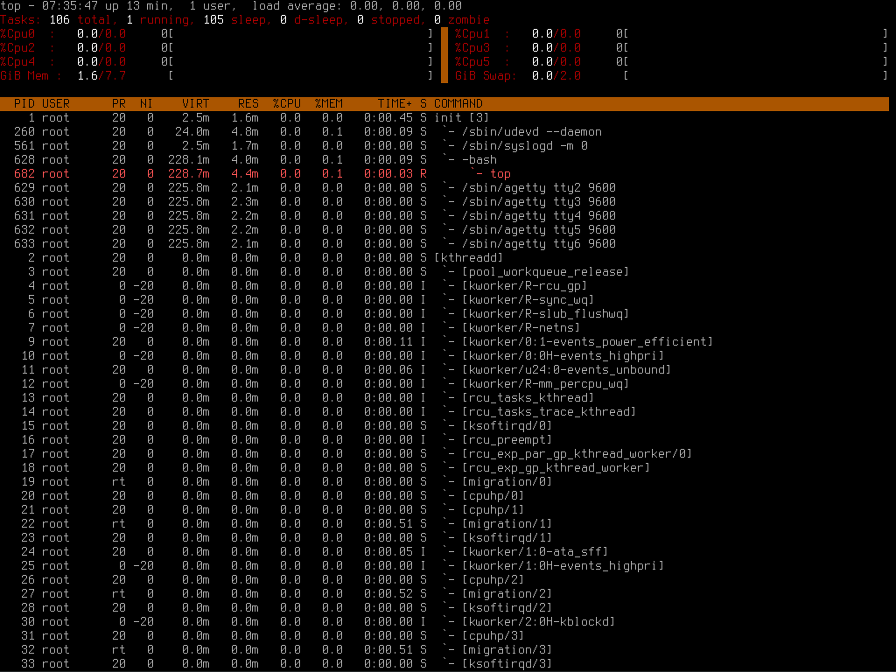

# Linux From Scratch 12.3

This is my personal experience of building Linux From Scratch 12.3. The main goal was to understand how Linux-based systems work under the hood.

## Main Features

- Architecture: x86_64
- Kernel: Linux 6.13.4
- LFS Book version: 12.3
- Boot method: UEFI + GRUB
- Init: SysVinit

## Repository Contents

- `configs/` — essential system configuration files (`fstab`, `grub.cfg`, `rc.site` etc.)
- `scripts/` — helper scripts I used during installation
- `images/` — screenshots of the running system
- `README.md` — this description

## Screenshots

Click to expand

*GRUB boot menu*

*System login prompt*

*System running and showing processes*

## Why I did this

- To learn how Linux works at a low level;
- To build and configure a Linux system manually;
- To gain a deeper understanding of the kernel, init system, and boot process;
- As a valuable learning experience.

## Links

- [Official website LFS](https://www.linuxfromscratch.org/)

_Note: This repository does not include binaries or source code - only configuration files, screenshots, and scripts used during the build._
